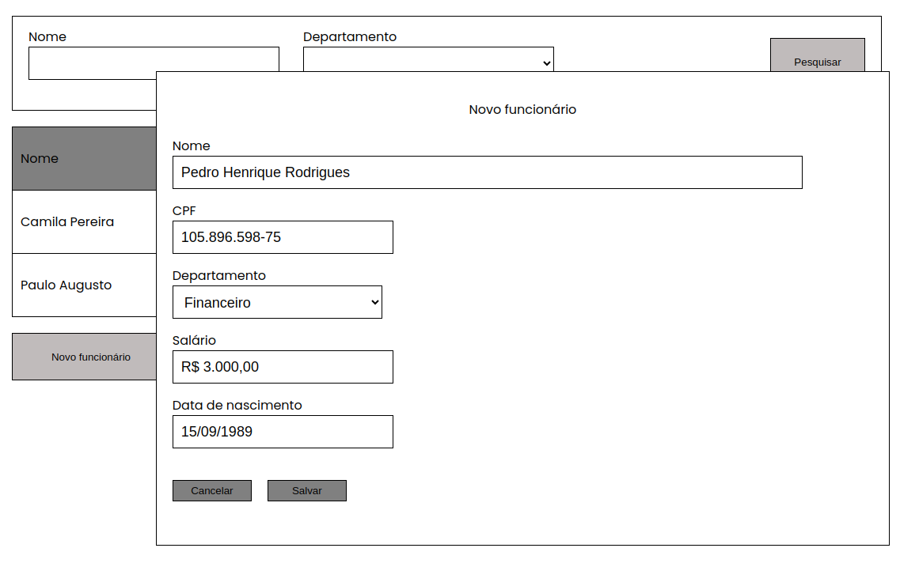

# Employee Registration System

Front-end that enables you to find, create, delete and update your employees.
- [click here](https://employee-registration-page.vercel.app/) to access the application

- At first it shows all your registered employees.

- Typing the employee's name, or part of it and pressing the 'Pesquisar' button you will filter the results by name.

- You can also select a department and filter the search by it.

- By pressing the 'Novo funcionário' button you will be able to register a new employee.
- In the popup that will apper all you have to do is fill in the employee informations.
- To save this new employee press the button 'salvar'.
- To cancel to action press the button 'cancelar'

- For the existing employees you can edit its information or delete it.
- To edit it you have to press the word 'editar' in the employee row.
- In the popup will have all the employee's informations prefilled. You can edit any information and then ask them to be saved pressing the button 'salvar'.
- To cancel to action press the button 'cancelar'

- To delete a employee you will have to press the word 'deletar' in the employee row.
- In the popup will have the employee's name and CPF. You can delete the employee by pressing th button 'Excluir'.
- To cancel to action press the button 'cancelar'


## About

Weather is a web browser application with which you can access the database of your employees. In this aplication you are able to see the employee's information, search for a especific employee and create a new employee. You can also edit and delete and existing employee.

## How to run for development

1. Clone this repository
2. Install all dependencies

```bash
npm i
```

3. Populate `.env` file based on `.env.example`. `VITE_API_URL` should point to the API server this application was made to run using the API avaible on the url: https://employee-registration-z6uu.onrender.com

4. Run the application in a development environment:

```bash
npm run dev
```